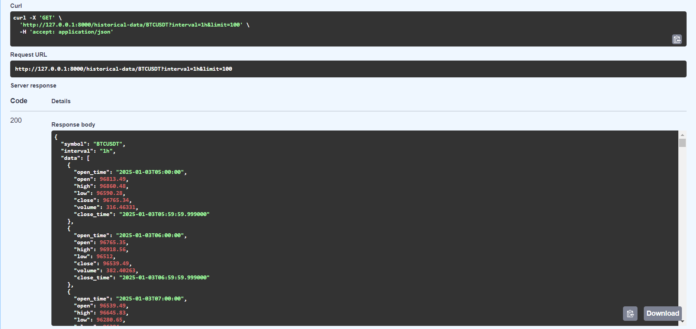
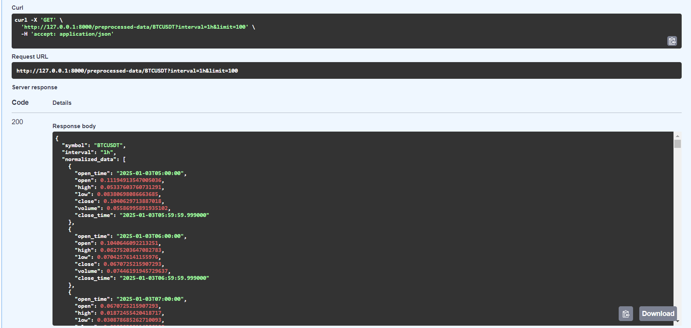
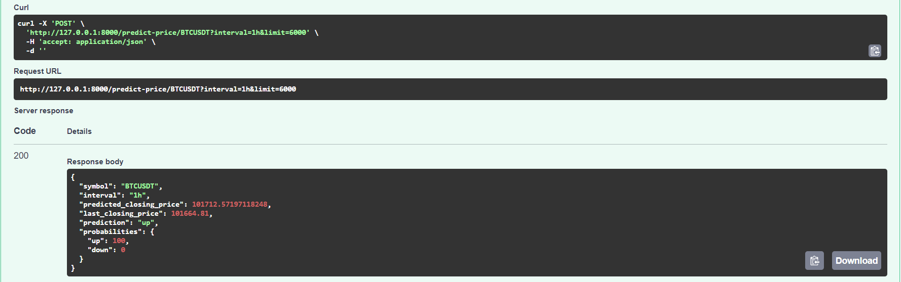
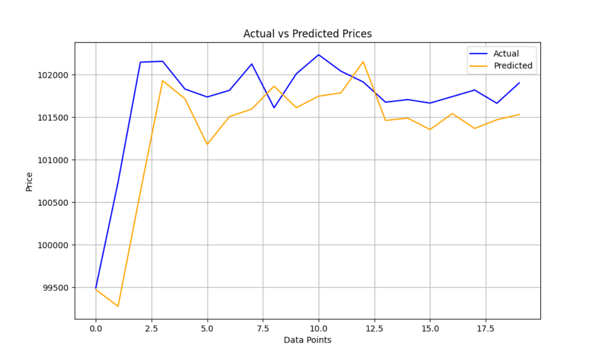

# Price.ai - Crypto Price Prediction System

Price.ai is a powerful tool designed to predict cryptocurrency prices using advanced machine learning algorithms and real-time data analysis. This system provides accurate forecasts and insights to help traders and investors make informed decisions in the volatile crypto market.

## 🚀 Features

- **Real-Time Data**: Fetches live cryptocurrency data from trusted APIs.
- **Advanced Predictions**: Uses state-of-the-art machine learning models to predict price movements.
- **Customizable Models**: Fine-tune prediction parameters for specific cryptocurrencies and time intervals.
- **Interactive Charts**: Visualize historical and predicted prices through intuitive and dynamic charts.
- **User-Friendly Interface**: Simple and modern UI for seamless user interaction.

## 🛠️ Technology Stack

- **Frontend**: React, Tailwind CSS, Lightweight Charts
- **Backend**: Python, FastAPI
- **Machine Learning**: Python, TensorFlow, Scikit-learn
- **APIs**: Binance, or other crypto data providers

## 📦 Installation

1. Clone the repository:
   - Frontend:
        ```bash
        https://github.com/tapas-code/price.ai_client.git
        cd price.ai_client
        ```
   - Backend:
        ```bash
        https://github.com/tapas-code/price.ai_server.git
        cd price.ai_server
        ```

2. Install dependencies:
   - Backend:
     ```bash
     cd backend
     pip install requirements.txt
     ```
   - Frontend:
     ```bash
     cd frontend
     npm install
     ```

3. Set up environment variables:
   Create a `.env` file in the `backend` directory with the following:
   ```env
   BINANCE_API_KEY=your-binance-api-key
   BINANCE_API_SECRET=your-binance-api-secret
   ```

4. Run the application:
   - Start the backend:
     ```bash
     cd backend
     uvicorn main:app --reload
     ```
   - Start the frontend:
     ```bash
     cd frontend
     npm run dev
     ```

5. Access the application:
   Visit `http://localhost:5173` in your browser.

## ⚙️ Usage

1. Select a cryptocurrency and time interval for prediction.
2. View the real-time chart and predictions.
3. Adjust model parameters (if enabled) for customized predictions.
4. Download prediction data for further analysis.

## 📈 How It Works

1. **Data Collection**: Fetches live market data from cryptocurrency APIs.
2. **Preprocessing**: Cleans and normalizes the data for machine learning models.
3. **Prediction**: Runs the data through trained models to predict price movements.
4. **Visualization**: Displays predictions alongside historical data in an interactive chart.

## 🤖 Machine Learning Models

Price.ai supports the following models:
- **LSTM (Long Short-Term Memory)**: For time-series predictions.
- **ARIMA (AutoRegressive Integrated Moving Average)**: For statistical forecasting.
- **Random Forest**: For robust regression and classification tasks.

## 🌐 Live Demo

Access the live demo at [price.ai-demo.com](#) (update this with your deployed link [Coming Soon] ).

### Binance Historical Data

### Pre-processed Data

### Crypto Price Prediction

### Back-testing


## 📚 Documentation

Detailed documentation is available in the `docs/` directory, including:
- API reference
- Model details
- Customization guides

## 🤝 Contributing

Contributions are welcome! Please follow these steps:
1. Fork the repository.
2. Create a new branch (`feature/your-feature`).
3. Commit your changes and push them to the branch.
4. Submit a pull request.

## 🛡️ License

This project is licensed under the [MIT License](LICENSE).

## 📧 Contact

For questions or feedback, contact us at:
- **Email**: support@price.ai
- **Twitter**: [@price_ai](https://twitter.com/price_ai)